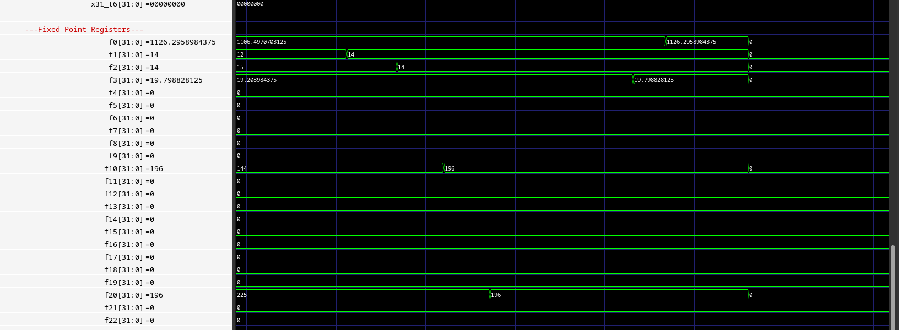

<!--  LUMOS RISC-V -->
Computer Organization - Spring 2024
==============================================================
## Iran Univeristy of Science and Technology
## Assignment 1: Assembly code execution on phoeniX RISC-V core

- Name:amirhossein poormirza
- Team Members:mohammadrezamiandehi-parsazabihirad
- Student ID: 99400091
- Date:1403/4/10

## Report

- Wirte your report and the final result of the assembly code here!
- Attach the waveform image to the README.md file
<div direction="rtl" align="justify">

## طراحی رادیکال

طبق الگوریتم پیشنهاد شده یک ماشین حالت برای محاسبه رادیکال طراحی شده است. برای عدد اعشاری ممیز ثابت $w$ بیتی که $f$ بیت آن قسمت اعشاری است، این الگوریتم در 
$(f+w)\over2$
 کلاک خروجی را محاسبه می‌کند. البته دو کلاک اضافه یکی برای مقداردهی اولیه رجیسترهای مورد نیاز الگوریتم و یکی برای منتظر ماندن برای درخواست محاسبه پس از اتمام انجام محاسبات فعلی برای کارکرد صحیح این لازم هستند.

```
reg [4:0] root_cycle;
reg [WIDTH+FBITS-1:0] root_op, radicand, root_res;
wire [WIDTH+FBITS-1:0] rem;

always @(posedge clk, posedge reset) begin
    if (reset) begin
        root_cycle <= (WIDTH+FBITS)/2+2;            
    end else if (operation == `FPU_SQRT) begin
        root_cycle <= root_cycle == (WIDTH+FBITS)/2+2 ? 0 : root_cycle+1;
    end        
end

```
در قطعه کد بالا با ریست شدن به آخرین کلاک (یا حالت) رفته که در این کلاک منتظر درخواست محاسبه‌ی رادیکال هستیم. وقتی که درخواست محاسبه‌ی رادیکال فعال باشد، یکی یکی کلاک‌ها را افزایش داده و طبق تعداد کلاک‌های لازم برای اتمام محاسبات دوباره به صفر برمی‌گردیم.

```
always @(posedge clk) begin
    if (root_cycle == 0) begin 
        root_op <= operand_1[WIDTH-3:0] << FBITS;
        root_ready <= 0;
    end else if (root_cycle == (WIDTH+FBITS)/2+1) begin
        root_ready <= 1;
        root_op <= root_op << 2;
    end else begin
        root_ready <= 0;
        root_op <= root_op << 2;
    end
end

assign rem = radicand - ({root, 2'b01});


always @(posedge clk) begin
    if (root_cycle == 0) begin
        radicand <= operand_1[WIDTH-1:WIDTH-2];
        root <= 0;
    end else begin
        if (rem[WIDTH+FBITS-1]) begin
            root <= {root, 1'b0};
            radicand <= {radicand, root_op[WIDTH+FBITS-1:WIDTH+FBITS-2]};
        end else begin
            root <= {root, 1'b1};
            radicand <= {rem, root_op[WIDTH+FBITS-1:WIDTH+FBITS-2]};
        end
    end
end
```
سپس الگوریتم را به صورت بالا پیاده‌سازی می‌کنیم. ابتدا لازم است در کلاک اول مقادیر رجیسترها را مشخص کنیم. رجیستر 
$radicand$
 ابتدا شامل دو بیت باارزش ورودی می‌شود. همچنین باقی بیت‌های ورودی را داخل یک رجیستر به نام $root\_op$ قرار می‌دهیم. در کلاک‌های بعدی لازم است $root\_op$ را دو بیت شیفت به چپ دهیم و بیت‌های خارج شده را به انتهای $radicand$ اضافه کنیم.

 در الگوریتم پیشنهاد شده لازم است در هر کلاک یک تفریق محاسبه شود. در این تفریق که حاصل آن در مقدار $rem$ نگهداری می‌شود، دو بیت $01$ به انتهای جواب فعلی ($root$) اضافه شده و از مقدار فعلی $radicand$ کم می‌شود.

 در بلوک دوم کد بالا، اگر حاصل تفریق منفی باشد، به $radicand$ دو بیت باارزش $root\_op$ را اضفه می‌کنیم. اگر حاصل مثبت باشد، حاصل تفریق را (به علاوه دو بیت اضافه شده) برابر با $radicand$ قرار می‌دهیم.
 
 در کلاک یکی مانده به آخر حاصل درست رادیکال آماده شده است و سیگنال $ready$ را فعال می‌کنیم.
 
 ## محاسبه‌ی ضرب

 طبق روش پیشنهاد شده یک عملیات ضرب در ۵ کلاک محاسبه می‌شود. در اینجا نیز یک کلاک اضافه‌تر برای منتظر ماندن برای دستور ضرب نیاز داریم.

```
reg [2:0] multiplier_cycle;

always @(posedge clk or posedge reset) begin
    if (reset) begin
        multiplier_cycle <= 5;
    end else if (operation == `FPU_MUL) begin
        multiplier_cycle <= multiplier_cycle == 5 ? 0 : multiplier_cycle+1;
    end        
end


always @(multiplier_cycle, multiplierCircuitResult) begin
    case (multiplier_cycle)
        0: begin 
            multiplierCircuitInput1 <= operand_1[15:0];
            multiplierCircuitInput2 <= operand_2[15:0];
            partialProduct1 <= multiplierCircuitResult;
            product <= 64'bz;
            product_ready <= 0;
        end
        1: begin
            multiplierCircuitInput1 <= operand_1[15:0];
            multiplierCircuitInput2 <= operand_2[31:16];
            partialProduct2 <= multiplierCircuitResult;
            product <= 64'bz;
            product_ready <= 0;
        end
        2: begin
            multiplierCircuitInput1 <= operand_1[31:16];
            multiplierCircuitInput2 <= operand_2[15:0];
            partialProduct3 <= multiplierCircuitResult;
            product <= 64'bz;
            product_ready <= 0;
        end
        3: begin
            multiplierCircuitInput1 <= operand_1[31:16];
            multiplierCircuitInput2 <= operand_2[31:16];
            partialProduct4 <= multiplierCircuitResult;
            product <= 64'bz;
            product_ready <= 0;
        end
        4: begin
            multiplierCircuitInput1 <= 16'bz;
            multiplierCircuitInput2 <= 16'bz;
            product <= ({32'd0, partialProduct1} + {16'd0, partialProduct2, 16'd0} + {16'd0, partialProduct3, 16'd0} + {partialProduct4, 32'd0});
            product_ready <= 1;
        end
        default: begin
            multiplierCircuitInput1 <= 16'bz;
            multiplierCircuitInput2 <= 16'bz;
            product <= 64'bz;
            product_ready <= 0;
        end
    endcase
end
```
طبق روش پیشنهاد شده در چهار کلاک حاصلضرب‌های جزئی محاسبه شده‌اند و در کلاک پنجم این حاصلضرب‌ها (پس از اضافه‌کردن بیت‌های صفر لازم) با یکدیگر جمع شده‌اند و حاصلضرب نهایی به دست آمده است.

## صحت‌سنجی

دو تست داده شده برای صحت‌سنجی استفاده شده‌اند. در تست اول فقط ماژول محاسبات اعشاری صحت‌سنجی شده است. شکل زیر موج خروجی این تست را نمایش می‌دهد.


در این تست چهار عملیات مختلف اعشاری صحت‌سنجی شده‌اند. با توجه به شکل موج، اعتبار طراحی را می‌توان نتیجه گرفت.

در تست دوم یک کد اسمبلی که فاصله‌ی نقاط موجود در یک مسیر را محاسبه می‌کند روی پردازنده اجرا شده است.

```
main:
        li          sp,     0x3C00
        addi        gp,     sp,     392
loop:
        flw         f1,     0(sp)
        flw         f2,     4(sp)
       
        fmul.s      f10,    f1,     f1
        fmul.s      f20,    f2,     f2
        fadd.s      f30,    f10,    f20
        fsqrt.s     x3,     f30
        fadd.s      f0,     f0,     f3

        addi        sp,     sp,     8
        blt         sp,     gp,     loop
        ebreak

```

فاصله‌ی نقاط روی مسیر به صورت یک آرایه به صورت پشت‌سرهم درون حافظه قرار گرفته‌اند. در این آرایه به ترتیب ابتدا فاصله‌ی $x$ دو نقطه متوالی و سپس فاصله‌ي $y$ آن دو آورده شده است. این داده‌ها برای ۵۰ نقطه به همین ترتیب نوشته شده‌اند.

دو خط اول این کد ثبات $sp$ را برابر با آدرس حافظه شروع داده ها و ثبات $gp$ برابر با آدرس آخرین داده (فاصله) قرار داده شده است.

سپس در یک حلقه ابتدا دو مقدار از آرایه خوانده شده و مجذور آن‌ها حساب شده است. سپس دو مقدار جمع شده و جذر حاصل جمع با مقدار فعلی $f0$ جمع می‌شود. این عملیات تا رسیدن به انتهای آرایه ادامه پیدا می‌کند. به این شکل مقدار فاصله نقاط روی مسیر محاسبه شده است و مقدار نهایی روی ثبات $f0$ قرار گرفته است.

پس از اجرای تست شکل موج زیر به دست آمده است. مقدار به دست آمده با دقت خوبی برابر با مقدار مورد انتظار است که صحت پیاده‌سازی را نشان می‌دهد.



</div>
